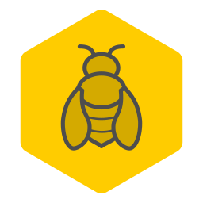

<h2 align="center">bee-pe</h2>

Experimental business process engine in TypeScript.

  

   

**_WARNING: This project is still in preliminary phase used to clarify the
fundamental architectural concepts. Please do not try to use it yet!_**

**bee-pe** is a process modeling and execution engine intended for programmers
of business applications. It provides a lightweight and performing execution
engine enabling to run hundreds of thousands of processes concurrently.

## Features

- **Fluent modeling API** provides a natural way of specification business
  processes.
- Implemented as **internal DSL** built in TypeStript.
- Support for process models structurally and semantically close to:
  - **BPMN** - core of process models from [BPMN](https://www.bpmn.org/),
  - **Goals** - goal-oriented process models inspired by
    [GO-BPMN](https://lsps-docs.whitestein.com/data/3_6/modeling-language/goalmodels.html),
    and
  - **State machines** - simplified version of [UML]() state machines
- Fully **executable models** with robust operational semantics.
- **Transaction-based process execution** triggered by various events (time,
  conditions, signals, etc.) with the possibility to **persist** execution
  status.
- **Extensible** in the way that users are able to modify and extend the
  existing modeling constructs and their executional semantics or create own
  process languages
- The basic in-memory and single-node engine deployment runs on
  [node.js](https://nodejs.org/).
- Persistent and possibly also distributed deployment runs on
  [Nest](https://nestjs.com/).

## Links

- [Documentation wiki page](https://github.com/Rado-1/bee-pe/wiki)
